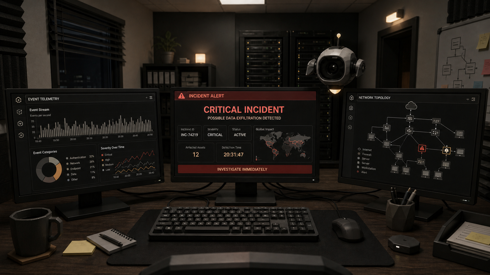

# CYCASE Documentation

Status: pre-production\
Working title: **CYCASE — Cyber Case Simulation**\
Target: OpenAI WebMCP Challenge, September 3, 2026

This folder is the source of truth for implementation and review. `CYCASE` is a working title and can be replaced globally after the team locks the final name.

Current release gate: **NO-GO**. The binding product and implementation direction is [NODELESS_SOC_REDESIGN_2026-08-31.md](./NODELESS_SOC_REDESIGN_2026-08-31.md). The deterministic simulation, visible dynamic narration, browser TTS and native seven-tool WebMCP path pass. Owner visual approval, final-product-SHA evidence, alarm assets, manual player checks, HTTPS deployment and the real ChatGPT/Codex built-in-browser proof remain.

## Documents

Listed in order of precedence: where two documents disagree, the higher one wins.

- [NODELESS_SOC_REDESIGN_2026-08-31.md](./NODELESS_SOC_REDESIGN_2026-08-31.md): the binding single-assistant story, enterprise SOC information architecture, three-monitor contract and implementation gates, and the removal of the second in-world character. This supersedes every unexecuted prompt that contradicts it.
- [PROJECT_CONTEXT.md](./PROJECT_CONTEXT.md): new contributor/AI master context; read this first for the shape of the project.
- [PRODUCT_SPEC.md](./PRODUCT_SPEC.md): product scope, architecture, MVP and acceptance criteria.
- [GAME_FLOW.md](./GAME_FLOW.md): opening sequence, Case 001 and player decisions.
- [DESIGN_SYSTEM.md](./DESIGN_SYSTEM.md): visual language, UI components, motion and accessibility.
- [ASSET_PIPELINE.md](./ASSET_PIPELINE.md): free 3D sources, AI generation and optimization pipeline.
- [WEBMCP_CONTRACT.md](./WEBMCP_CONTRACT.md): the seven browser tool contracts, the narration rules and the state rules.
- [BACKEND_RUNTIME_CONTRACT.md](./BACKEND_RUNTIME_CONTRACT.md): persistence, replay, telemetry and optional scenario-generation boundary.
- [CODEX_WEBMCP_INTEGRATION.md](./CODEX_WEBMCP_INTEGRATION.md): official Codex site-tools path, safety contract and native/browser test matrix.

### Historical

Kept as a record of what was decided and why. They are superseded by the redesign wherever they disagree with it, and none of them is a task list to execute now.

- [VISUAL_RESET.md](./VISUAL_RESET.md): the earlier V2 art-direction and real-time behavior correction.

## Visual Reference

This image is the agreed reference direction and a build reference — not a production texture, not a final UI, and not a target the build is claimed to match. Rebuild the scene from modular licensed assets and native DOM monitor interfaces. The captured visual direction of the built scene is still owner work that no test can close (NODELESS_SOC_REDESIGN_2026-08-31.md §11).

## Locked Decisions

- Desktop-first browser experience; 2D fallback below 1024 px.
- React + TypeScript + Vite + Three.js/React Three Fiber + XState.
- One WebGL canvas; no physics engine; no mandatory post-processing.
- The story wording is dynamic; the security case is not. VERA is the only in-world assistant. Codex is an external teacher/agent with no avatar. The LLM writes state-grounded explanations, hints, responses to mistakes and future schema-validated case-pack content. The engine owns valid actions, telemetry and evidence relationships, state progression, consequences, score, idempotency, security boundaries and scenario schema validation. An LLM must never decide score, a valid action, or state progression.
- Generated narration reaches the page through one tool, `present_guidance`, and reaches nothing else. It carries a message, a tone and a language and no speaker field: the agent chooses the words and the tone, the page owns the one delivery channel. Browser TTS starts only after a user gesture, every line is captioned in full and one global Narration on/off control owns the preference.
- No essential dialogue disappears on a timer. VERA's report stays on screen through both the `assistantReporting` and `briefingChoice` beats, and the choice — "Explain the incident" or "Open response console" — is added beneath it.
- With no agent connected, a deterministic fallback line set narrates the case and the run produces the same score and ending.
- The page exposes real WebMCP tools through `document.modelContext`.
- Robots, pets, holograms, floating guide objects and any second in-world avatar are forbidden in the active product.
- All external assets must have a recorded license before entering the repository.
